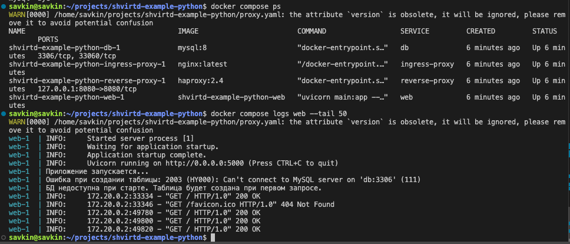
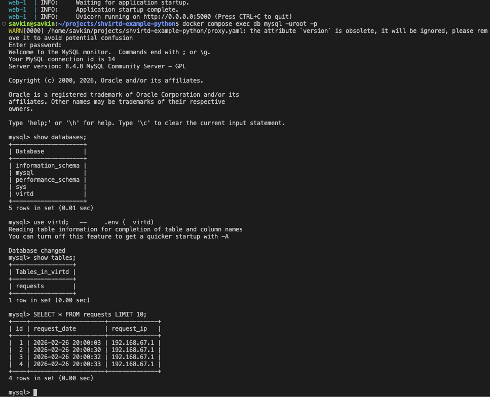
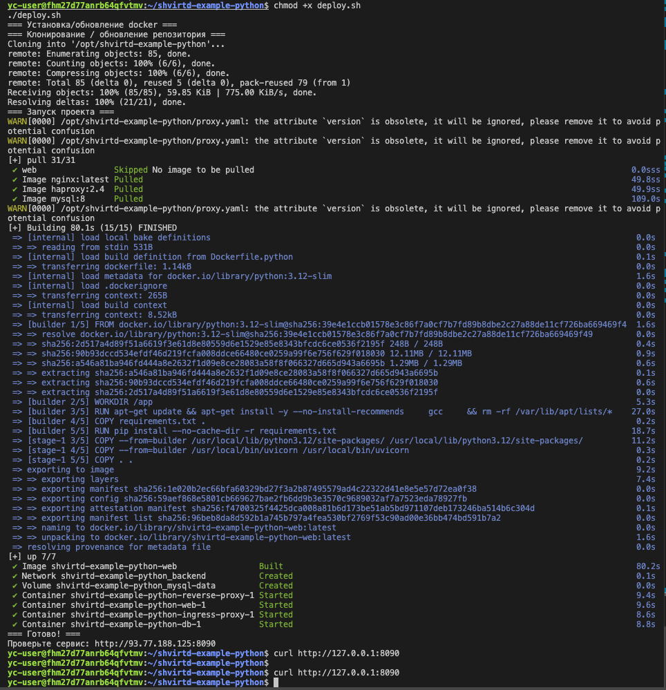
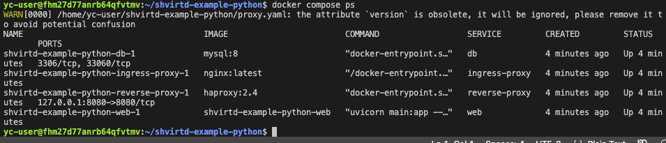
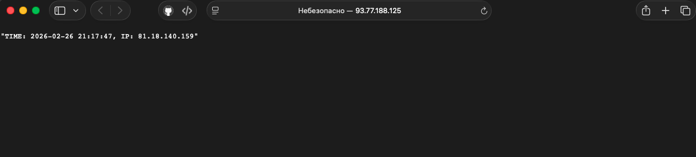
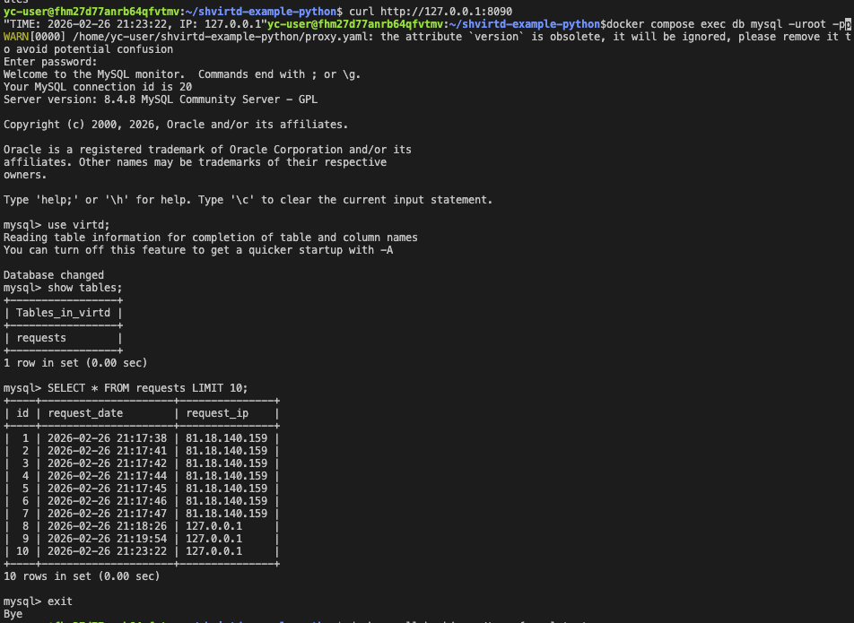
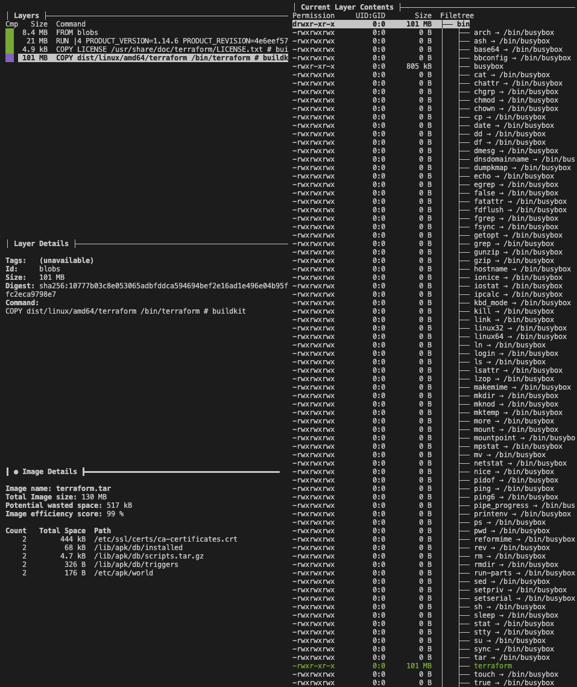
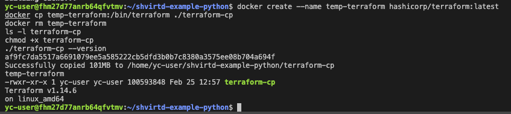
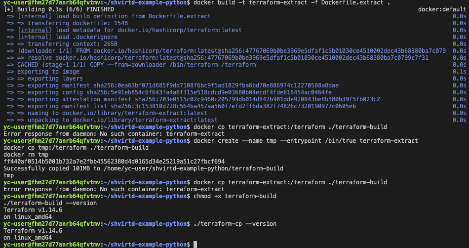

# Практическое применение Docker (Занятие 5)

Репозиторий с решением домашнего задания по курсу DevOps (Netology).

## Задача 0 — Проверка docker compose

Выполнена проверка:  
`docker-compose --version` → command not found (удалён старый пакет)  
`docker compose version` → v2.x.x (или v5.0.2 на ВМ)

## Задача 1 — Dockerfile.python (multistage сборка)

Создан `Dockerfile.python` на базе `python:3.12-slim` с multistage-сборкой.  
Использованы `COPY . .` и `CMD ["uvicorn", "main:app", "--host", "0.0.0.0", "--port", "5000"]`.  
Создан `.dockerignore` для исключения ненужных файлов.

Ссылка на форк [shvirtd-example-python](https://github.com/SavkinILYA/shvirtd-example-python)

Локальный запуск контейнера (без БД — ожидаемая ошибка подключения):

## Задача 3 — compose.yaml + запуск проекта локально

Создан `compose.yaml` с `include: proxy.yaml`, сервисами `web` и `db`, сетью `backend` (172.20.0.0/24), фиксированными IP, `restart: always`, использованием `.env`.

Подключение к БД и проверка таблицы requests:

## Задача 4 — деплой на ВМ в Yandex Cloud
ВМ создана через yc CLI: Ubuntu 24.04, 2 vCPU, 2 ГБ RAM, preemptible, публичный IP: `93.77.188.125`.
Создан скрипт `deploy.sh` — скачивает репозиторий в `/opt` и запускает `docker compose up -d --build`.

Статус после деплоя на ВМ:

SQL-запрос на сервере после запросов:

Задача 6 / 6.1 / 6.2 — извлечение /bin/terraform из образа

